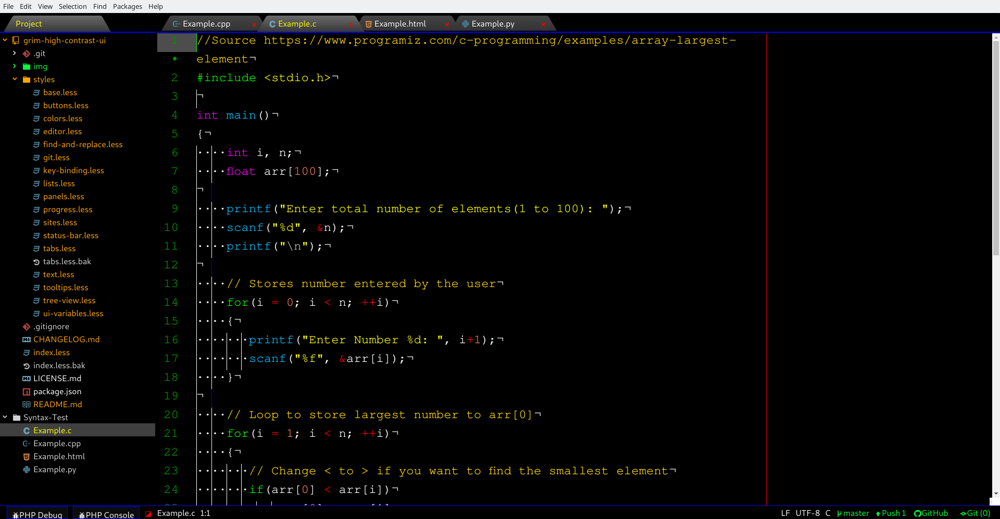

# grim-vibrant-syntax
This is a colorful syntax theme for those of us who enjoy bright and easy to read code. It will Look Best When Used With my ui theme 'grim-high-contrast-ui.'
# HTML

# Bash

# C

# C++

# Python3

